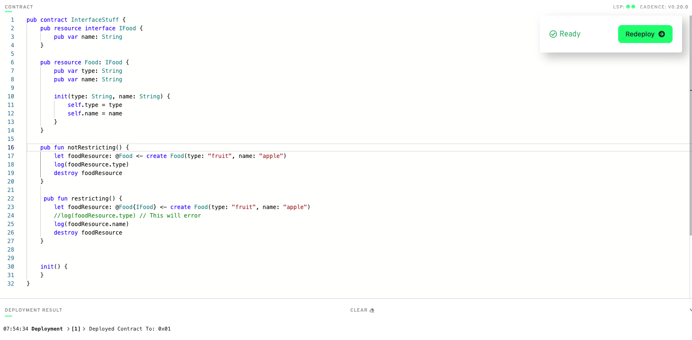
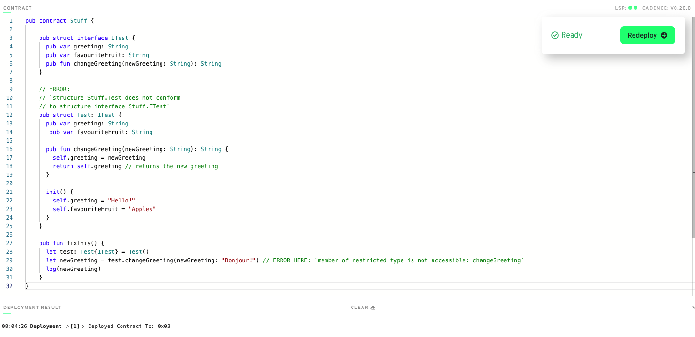
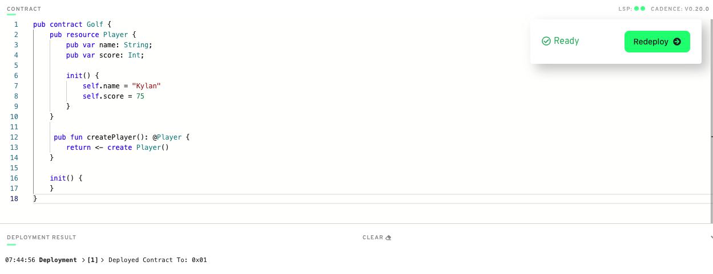
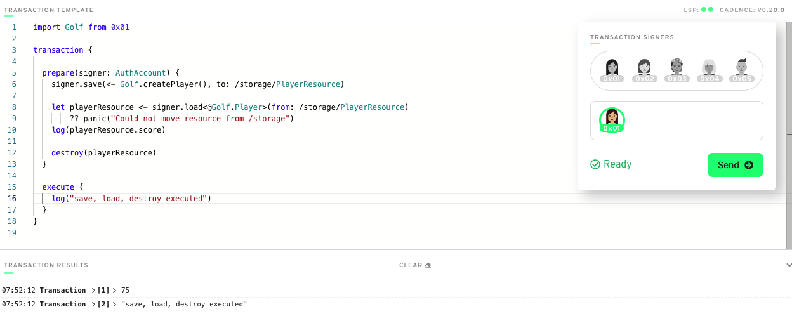
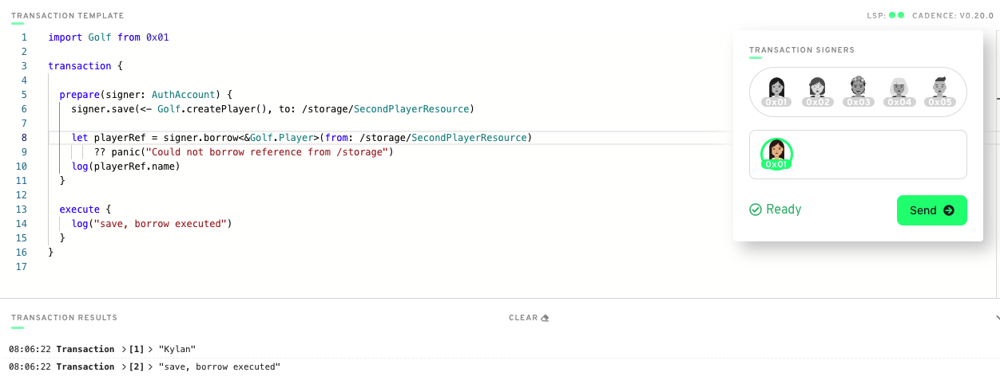
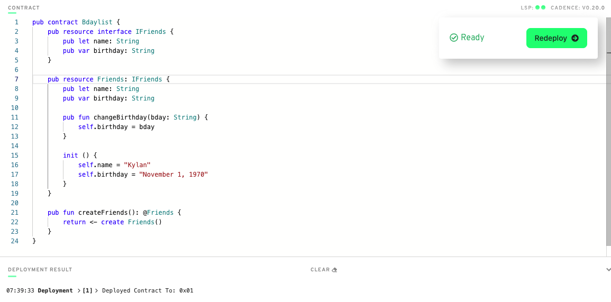
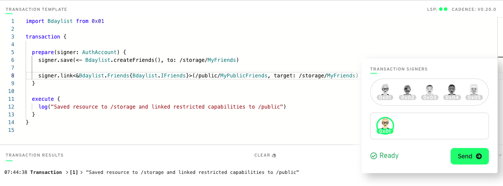
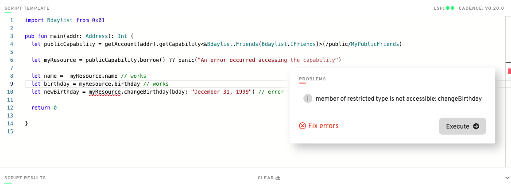
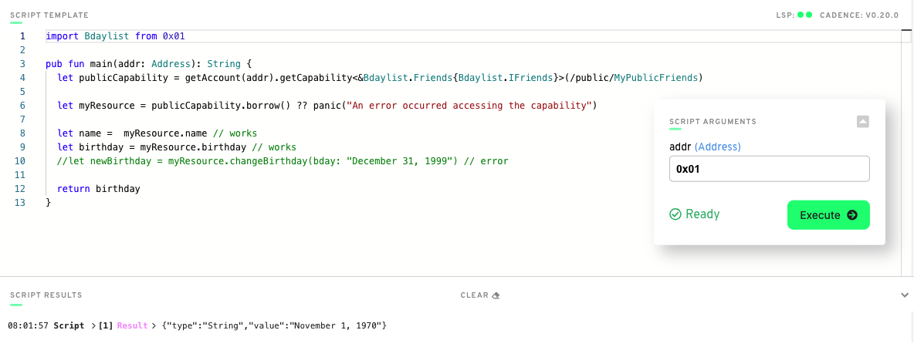

0x36c2120b78c5dea0

* Table of Contents
  * [Chapter 1, Day 1](#chapter-1-day-1)
  * [Chapter 1, Day 2](#chapter-1-day-2)
  * [Chapter 2, Day 1](#chapter-2-day-1)
  * [Chapter 2, Day 2](#chapter-2-day-2)
  * [Chapter 2, Day 3](#chapter-2-day-3)
  * [Chapter 2, Day 4](#chapter-2-day-4)
  * [Chapter 3, Day 1](#chapter-3-day-1)
  * [Chapter 3, Day 2](#chapter-3-day-2)
  * [Chapter 3, Day 3](#chapter-3-day-3)
  * [Chapter 3, Day 4](#chapter-3-day-4)
  * [Chapter 3, Day 5](#chapter-3-day-5)
  * [Chapter 4, Day 1](#chapter-4-day-1)
  * [Chapter 4, Day 2](#chapter-4-day-2)

## Chapter 1, Day 1
<strong>1. Explain what the Blockchain is in your own words.</strong>
> A publicly accessible, decentralized and open network of computers that collectively store an ever increasing "list" of data records or blocks. Each new block of data is "connected" to a previous block using cryptography, with each new one added reinforcing the security to past and future blocks as the chain of blocks (blockchain) continues to grow. 

<strong>2. Explain what a Smart Contract is.</strong>
> A sort of "computer program" that defines rules and very specific functions on how any user can interact with a blockchain. If a user would like to store some piece of data in a block on a blockchain, a programmer would need to write a smart contract to accomplish this specific task.

<strong>3. Explain the difference between a script and a transaction.</strong>
> Both are snippets of code (computer program) that can interact with a smart contract that has been deployed to a blockchain. Scripts are public and don't cost any money, generally they are used to read data from the blockchain. Transactions mutate (change) something on the blockchain and are subject to a gas (transaction) cost and a user signing the transactions (i.e. the one responsible for perfomring the mutation).

## Chapter 1, Day 2
<strong>1. What are the 5 Cadence Programming Language Pillars?</strong>
> 1. Safety and Security
> 2. Clarity
> 3. Approachability
> 4. Developer Experience (DX)
> 5. Resource Oriented Programming 

<strong>2. In your opinion, even without knowing anything about the Blockchain or coding, why could the 5 Pillars be useful (you don't have to answer this for #5)?</strong>
> 1. Safety and Security - making things more difficult to actually "mess up" and avoid inherently potential catastrophes when writing smart contracts is great asset to have in a programming language.

> 2. Clarity - making the language "clearer" by design, certainly will be a helpful asset (especially to newcomers) when working with the language in the wild for the first time.

> 3. Approachability - designing the language in such a way that can seem somewhat familiar to other langauges will certainly benefit those coming from other programming backgrounds.

> 4. DX - at the end of the day, the developer role has the responsibility of creating the methods and means of what exactly users can interact with (bascially be able to actually "do" things on the blockchain). The language designers consideration of improvements to the developer environment will absolutely help the developer be as efficient as possible and ultimately produce a better product. 

## Chapter 2, Day 1
<strong>1. Deploy a contract to account 0x03 called "JacobTucker". Inside that contract, declare a constant variable named is, and make it have type String. Initialize it to "the best" when your contract gets deployed.</strong>
> 

<strong>2. Check that your variable is actually equals "the best" by executing a script to read that variable.</strong>
> 

## Chapter 2, Day 2
<strong>1. Explain why we wouldn't call changeGreeting in a script.</strong>
> The function changeGreeting is changing (mutating) a state variable in the smart contract on the blockchain, which requires a user as a signer and a fee (gas), so in cadence, that is done in a transaction not a script.

<strong>2. What does the AuthAccount mean in the prepare phase of the transaction?</strong>
> Allows access to the user's flow account as the signer that is responsible for sending the transaction.

<strong>3. What is the difference between the prepare phase and the execute phase in the transaction?</strong>
> The execute phase of a transaction doesn't have access to the user account, which is needed when sending a transaction. While calling a function in the prepare phase would work the same as calling it in the execute phase, the separation of logic between the 2 phases creates better code organization and readability.

<strong>4a. Add a variable named myNumber that has type Int (set it to 0 when the contract is deployed) and a function named updateMyNumber that takes in a new number named newNumber as a parameter that has type Int and updates myNumber to be newNumber.</strong>
> 

<strong>4b. Add a script that reads myNumber from the contract.</strong>
> 

<strong>4c. Add a transaction that takes in a parameter named myNewNumber and passes it into the updateMyNumber function.</strong>
> 

<strong>4d. Verify that your number changed by running the script again.</strong>
> 

## Chapter 2, Day 3
<strong>1. In a script, initialize an array (that has length == 3) of your favourite people, represented as Strings, and log it.</strong>
> 

<strong>2. In a script, initialize a dictionary that maps the Strings Facebook, Instagram, Twitter, YouTube, Reddit, and LinkedIn to a UInt64 that represents the order in which you use them from most to least. For example, YouTube --> 1, Reddit --> 2, etc. If you've never used one before, map it to 0!</strong>
> 

<strong>3. Explain what the force unwrap operator ! does, with an example different from the one I showed you (you can just change the type).</strong>
> If a variable is an optional (i.e. the value can be whatever is assigned to it OR nil) and we want the actual type value out of it, cadence requires us to use the force-unwrap operator "!" to achieve this. When using the force-unwrap operator "!" and the optional value is nil, the result panics and execution is aborted.
> 

<strong>4a. What does the error message mean?</strong>
> When using dictionaries in cadence, elements in the dictionary are optionals by default, so the return type should be String? instead of String.

<strong>4b. Why we're getting this error?</strong>
> Because the script is trying to get the value out of the dictionary by key (which is an optional), the return type needs to be changed to String? or we need to use the force-unwrap operator.

<strong>4c. How to fix it?</strong>
> Add the force-unwrap operator to the return statement (return thing[0x03]!) or change the return type to String?.

## Chapter 2, Day 4
<strong>1,2,3. Deploy a new contract that has a Struct of your choosing inside of it (must be different than Profile). Create a dictionary or array that contains the Struct you defined. Create a function to add to that array/dictionary.</strong>
> 

<strong>4. Add a transaction to call that function in step 3.</strong>
> 

<strong>5. Add a script to read the Struct you defined.</strong>
> 

## Chapter 3, Day 1
<strong>1. In words, list 3 reasons why structs are different from resources.</strong>
> a. Structs can be copied or overwritten, resources cannot, they can be created exactly once, and must be moved or destroyed.
b. Structs can be created outside of a contract, resources can only be created in a contract.
c. Structs are containers of data, resources are very secure, well-kept containers of data that cannot be lost.

<strong>2. Describe a situation where a resource might be better to use than a struct.</strong>
> Since cadence makes losing a resource extremely difficult, resources are ideal for NFTs (whether super expensive or not) because unless you explicitly tell it to destroy, you can be very, very sure the NFT won't be lost and handled the way you as the developer intend it to.

<strong>3. What is the keyword to make a new resource?</strong>
> create

<strong>4. Can a resource be created in a script or transaction (assuming there isn't a public function to create one)?</strong>
> No, a resource can only be created in a contract.

<strong>5. What is the type of the resource below?</strong>
> @Jacob

<strong>6. I Spy 4 things wrong with this code. Please fix them.</strong>
> 

## Chapter 3, Day 2
<strong>1. Write your own smart contract that contains two state variables: an array of resources, and a dictionary of resources. Add functions to remove and add to each of them.</strong>
```cadence
pub contract CardGame {
    pub var players: @[Player]
    pub var details: @{UInt64: Detail}

    pub resource Player {
        pub let id: UInt64

        init() {
            self.id = 1
        }
    }

    pub resource Detail {
        pub let id: UInt64
        pub let name: String

        init() {
            self.id = 1
            self.name = "Kylan"
        }
    }

    pub fun addPlayer(player: @Player) {
        self.players.append(<- player)
    }

    pub fun removePlayer(index: Int): @Player {
        return <- self.players.remove(at: index)
    }

    pub fun addDetail(detail: @Detail) {
        let key = detail.id
        let oldDetail <- self.details[key] <- detail
        destroy oldDetail
    }

    pub fun removeDetail(key: UInt64): @Detail {
        let detail <- self.details.remove(key: key)
                ?? panic("Could not find detail")
        return <- detail
    }

    init() {
        self.players <- []
        self.details <- {}
    }
}
```

## Chapter 3, Day 3
<strong>1. Define your own contract that stores a dictionary of resources. Add a function to get a reference to one of the resources in the dictionary.</strong>
> 

<strong>2. Create a script that reads information from that resource using the reference from the function you defined in part 1.</strong>
> 

<strong>3. Explain, in your own words, why references can be useful in Cadence.</strong>
> References seem like they can be a kind of "shortcut" to getting at the information we want in a resource without having to keep track of and move the actual resource around as per the normal rules of cadence (can only exist in one location at a time, must be used exactly once and either moved or destroyed once finished).

## Chapter 3, Day 4
<strong>1. Explain, in your own words, the 2 things resource interfaces can be used for (we went over both in today's content).</strong>
> Interfaces in Cadence allow the developer to specify requirements for something, i.e. the ability to selectively expose / don't expose a variable or function contained in a resource.

<strong>2. Define your own contract. Make your own resource interface and a resource that implements the interface. Create 2 functions. In the 1st function, show an example of not restricting the type of the resource and accessing its content. In the 2nd function, show an example of restricting the type of the resource and NOT being able to access its content.</strong>
> 

<strong>3. How would we fix this code?</strong>
> Add favouriteFruit variable definiton to Test (if an interface contains something, it must also be present in the struct that is implementing it). Add self.FavouriteFruit to init. Add the changeGreeting function definition to ITest.
> 

## Chapter 3, Day 5
<strong>For today's quest, you will be looking at a contract and a script. You will be looking at 4 variables (a, b, c, d) and 3 functions (publicFunc, contractFunc, privateFunc) defined in SomeContract. In each AREA (1, 2, 3, and 4), I want you to do the following: for each variable (a, b, c, and d), tell me in which areas they can be read (read scope) and which areas they can be modified (write scope). For each function (publicFunc, contractFunc, and privateFunc), simply tell me where they can be called.</strong>
> #### Area 1
> a - read yes, write yes<br>
> b - read yes, write yes<br>
> c - read yes, write yes<br>
> d - read yes, write yes<br>
> publicFunc - can be called<br>
> contractFunc - can be called<br>
> privateFunc - can be called<br>
	
> #### Area 2
> a - read yes, write yes<br>
> b - read yes, write no<br>
> c - read yes, write no<br>
> d - read no, write no<br>
> publicFunc - can be called<br>
> contractFunc - can be called<br>
> privateFunc - cannot be called<br>
	
> #### Area 3
> a - read yes, write yes<br>
> b - read yes, write no<br>
> c - read yes, write no<br>
> d - read no, write no<br>
> publicFunc - can be called<br>
> contractFunc - can be called<br>
> privateFunc - cannot be called<br>
	
> #### Area 4
> a - read yes, write yes<br>
> b - read yes, write no<br>
> c - read no, write no<br>
> d - read no, write no<br>
> publicFunc - can be called<br>
> contractFunc - cannot be called<br>
> privateFunc - cannot be called<br>

## Chapter 4, Day 1
<strong>1. Explain what lives inside of an account.</strong>
> One (or more) contracts deployed to said account and account storage (which has paths of /storage, /public, /private).

<strong>2. What is the difference between the /storage/, /public/, and /private/ paths?</strong>
> All data that is stored in said account lives in the /storage path (which is only accessable by the account owner). The /public/ path can contain data that the owner wants anyone to access. The /private path restricts data access to only the account owner and users that the owner gives access to.

<strong>3. What does .save() do? What does .load() do? What does .borrow() do?</strong>
> .save() allows the account owner to put something in /storage (i.e. a resource). .load() allows the owner to take something out of /storage (in the case of a resource, .load() will move the resource out of /storage and as such must either be returned or destroyed). Once this action is completed, the resource will no longer be in /storage (and could be saved again). .borrow() essentially creates a reference to some data in /storage, the resource is not moved (it remains in /storage), but we can use the reference to get variables or call functions that are defined in the resource.

<strong>4. Explain why we couldn't save something to our account storage inside of a script.</strong>
> A script doesn't have access to the account signer, which is required to save data to /storage.

<strong>5. Explain why I couldn't save something to your account.</strong>
> Only the account owner (signer) has the ability to save data to their /storage.

<strong>6. Define a contract that returns a resource that has at least 1 field in it.</strong>
> 

<strong>i. A transaction that first saves the resource to account storage, then loads it out of account storage, logs a field inside the resource, and destroys it.</strong>
> 

<strong>ii. A transaction that first saves the resource to account storage, then borrows a reference to it, and logs a field inside the resource.</strong>
> 

## Chapter 4, Day 2
<strong>1. What does .link() do?</strong>
> Creates a capability. For example, a capability can be used to "give" someone else access to certain data in owner's storage.

<strong>2. In your own words (no code), explain how we can use resource interfaces to only expose certain things to the /public/ path.</strong>
> Resource interfaces allow the owner to basically select (or restrict) what data (and/or functions) that can be exposed to someone else. In other words, if a resource contains a name and birthday variable and a function that can change the value of birthday, the owner may wish to give access to read the 2 variables to others, but not to execute the fucntion to change the birthday. This can be done by adding a resource interface that only contains the variable names (omits the function) and then restricting the linking of the resource by implemeting the interface.

<strong>3. Deploy a contract that contains a resource that implements a resource interface.</strong>
> 

<strong>i. In a transaction, save the resource to storage and link it to the public with the restrictive interface.</strong>
> 

<strong>ii. Run a script that tries to access a non-exposed field in the resource interface, and see the error pop up.</strong>
> 

<strong>iii. Run the script and access something you CAN read from. Return it from the script.</strong>
> 
